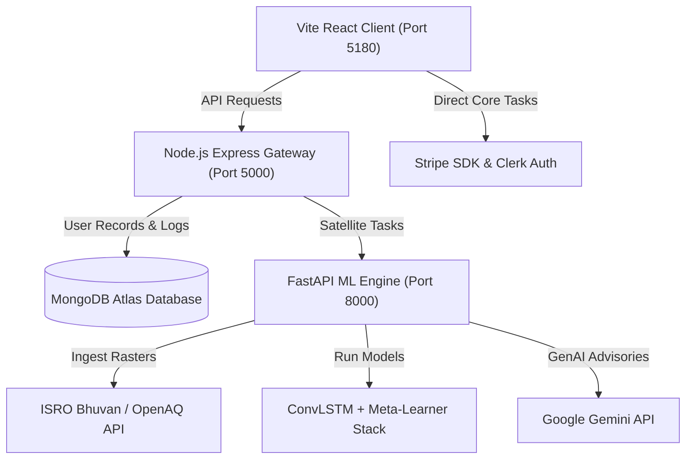

# 🛰️ ISRO Bhuvan BAH 2026: TerraTwin Project Brief & Technical Handbook

This document serves as the master guide and overview of the **TerraTwin** platform, prepared for team alignment and presentation building for the **ISRO Bhuvan Bharat Advanced Hackathon (BAH) 2026**.

---

## 📌 1. Hackathon Context & Problem Statement

### 🎯 The Challenge
**Spatiotemporal Environmental & Climate Telemetry Analysis using Multimodal Satellite Data for Real-Time Canopy and Heatmap Predictive Modelling (ISRO Bhuvan Integration).**

### ⚠️ The Problem
Traditional climate monitoring solutions operate in isolation. They present flat, static 2D tables of raw geospatial data that are difficult for decision-makers and the public to interpret. Furthermore, standard models fail to account for both rapid localized weather shifts (microclimates) and long-term macroclimate changes (atmospheric drift), resulting in inaccurate risk forecasts during erratic climate events like anomalous monsoons or winter thermal inversions.

---

## 🚀 2. The Solution: TerraTwin

**TerraTwin** is a premium, cutting-edge **Multimodal Climate Digital Twin & Spatiotemporal Telemetry Predictor**. It bridges the gap between complex geospatial telemetry and tangible ecological action by combining deep spatiotemporal neural networks with interactive WebGL-accelerated 3D planetary and regional visualizations.

### 💡 Core Concept
Rather than displaying isolated statistics, TerraTwin warps multi-source telemetry grids onto a unified **0.25° gridded predictive canvas** covering India. Users can click anywhere on a live 3D planet globe or dynamic regional map to query historical data, trigger predictive simulations, generate automated PDF reports, and fund verified reforestation campaigns to offset emissions.

---

## 🎨 3. Slide 3: Opportunity, Solution & USP Blueprint

*This section answers the three core questions evaluated by the ISRO BAH submission committee:*

### 🔍 Q1: How different is it from other existing ideas?
* **Ensembled Spatiotemporal Stacking:** Instead of relying on isolated statistical models, TerraTwin stacks deep temporal learning (**ConvLSTM**) with physical climatological anomaly persistence via a **Ridge Meta-Learner**. This allows the platform to capture both short-term weather fluctuations and long-term climate drift.
* **Immersive WebGL Interfaces:** It completely replaces flat, static tables with an immersive, WebGL-accelerated **3D rotating planet globe** and interactive regional maps using React Globe GL and MapLibre GL for fluid geospatial discovery.

### 🛠️ Q2: How will it solve the problem?
* **Unified 0.25° Geospatial Grid Canvas:** It normalizes disparate space and ground-level telemetry feeds (including **ISRO Bhuvan** landcover rasters, **OpenAQ** particulate logs, and local weather measurements) onto a unified coordinate grid matrix.
* **Precise Point Diagnostics:** Users can click on any individual grid cell to perform a **Precise Point Analysis**, instantly extracting local historical diagnostics, running 7-day temperature and rainfall trend predictions, and generating automated advisory PDFs.

### ✨ Q3: USP (Unique Selling Points) of the proposed solution
* **Hybrid Analytics Stacking (HAS):** Marries deep spatiotemporal neural networks directly with traditional statistical baseline corrections to guarantee high forecasting reliability during erratic Indian monsoons and localized heatwaves.
* **Community Action Feedback Loops:** Bridges predictions with real-world impact by linking real-time canopy degradation and risk data directly with **Stripe-backed reforestation campaigns**, letting users sponsor verified carbon offsets instantly.

---

## 🛠️ 4. System Architecture

TerraTwin is built as a **3-tier monorepo architecture** designed to run efficiently on localhost and scale to the cloud.



### 💻 Component Details:
1. **Frontend Portal (Client):** Built with **React 19** and **Vite** for lightning-fast speeds. Leverages **React Globe GL**, **MapLibre GL**, **Three.js**, and **Framer Motion** for 3D renderings and smooth animations. Managed via Redux Toolkit.
2. **Gateway Server (Node.js/Express):** Handles routing, coordinates API requests, stores campaign and user data in **MongoDB Atlas** via Mongoose, and processes transactions using **Stripe**. Secured using **Clerk JWT Authentication**.
3. **Telemetry & ML Engine (Python FastAPI):** Runs the core machine learning models in PyTorch, parses gridded satellite datasets using Rasterio/OpenCV, integrates with **Google Gemini API** for advisory text generation, and dispatches email reports via SMTP.

---

## 📊 5. Core Platform Features

### 🌐 1. Interactive 3D Digital Twin Globe
* **WebGL Heatmap Renderings:** Plots gas concentrations ($CO_2$, $CO$, $NO_2$, $SO_2$) dynamically using a custom density-gradient interpolator that maps clean zones (Deep Space Blue) to high-density zones (Glowing Rocket Orange).
* **Dataset Toggling:** Switch dynamically between global metrics including Air Quality Index (AQI), Forest Canopy Loss, and Solar Radiation.

### 🗺️ 2. National Bhuvan GIS Map (India Heatmap)
* **2.5D Column Extrusions:** Custom DeckGL layers displaying urban sprawl indexes and forest canopy loss across the Indian sub-continent.
* **Geocoding Coordinate Pin:** Drag and drop a marker anywhere in India to reverse-geocode coordinates and extract point-specific environmental diagnostics.

### ⚠️ 3. Interactive Climate EDA & PBL Column Simulator
* **Planetary Boundary Layer (PBL) Columns:** Interactive physics-based simulation of the atmospheric column. Displays real-time floating particle animations that pulsate and compress as users adjust the inversion ceiling height.
* **Seasonal Trend Analyses:** Comparison charts tracking PM2.5/PM10 spikes against meteorological conditions (Winter Thermal Inversion, Monsoon Scavenging, Post-Monsoon Biomass, Summer Ozone).

### 🧪 4. What-If Hazard Simulator & TerraBot
* **Atmospheric Parameter Sliders:** Modify simulated levels of air pollutants (PM2.5, PM10, $SO_2$, $NO_2$, $CO_2$) to see real-time health index fluctuations.
* **Automated AI Alert Agent:** Automatically scans localized AQI readings and dispatches critical warning emails via SMTP if thresholds are crossed.

### 🛰️ 5. Satellite Escrow & Offset Campaigns
* **Space Telemetry Console:** Connects to simulated active satellites (**ResourceSat-2A**, **Oceansat-3**, **Cartosat-2**, **RISAT-1A**) to query real-time orbital profiles (Soil Hydration, LST, NDVI, Cloud Obstruction).
* **Space Sentinel Footprint tracker:** Gamified dashboard tracking trees funded, carbon offsets, and awarding badges (Aryabhata Bronze, Rohini Gold, Gaganyaan Cosmic Patron).
* **Verifiable Certification:** Modal displaying printable, space-themed certificates with digital verification seals.

---

## 🧠 6. The Machine Learning & Processing Pipeline

The spatiotemporal telemetry model follows a sequential flow to ingest, analyze, predict, and notify:

```
[1. DATA INGESTION] ──> [2. GRID NORMALIZATION] ──> [3. HYBRID MODELING]
   ISRO Bhuvan LULC,       CRS EPSG:4326 Warping,    ConvLSTM Tensor Stacking
   OpenAQ & Weather APIs    0.25° Grid Alignment     XGBoost / Random Forest
                                                              │
                                                              ▼
[6. NOTIFICATION]  <─── [5. VISUALIZATION]     <──  [4. META-LEARNER]
   Stripe Offset Loop,     React Globe GL Heatmap,   Ridge Regression Stacking,
   SMTP PDF Advisories     Precise Point Query API   Climatology Bias Correction
```

### 🛰️ Detailed Datablock Operations:
1. **Data Ingestion:** Gathers land cover rasters (ISRO Bhuvan), live particulate logs (OpenAQ), and historical meteorological variables (temperature, humidity, precipitation).
2. **Grid Normalization:** Warps coordinate systems to WGS 84 (`EPSG:4326`), scales telemetry features to `[0.0, 1.0]`, and resamples grids using bilinear interpolation to fit a unified **0.25° gridded matrix**.
3. **Spatiotemporal Modeling:** Feeds sequences into a **PyTorch ConvLSTM** to extract spatial and temporal dynamics. Simultaneously runs tabular regressions (XGBoost/Random Forest) to analyze local feature weights.
4. **Meta-Learner Stacking:** Combines outputs using a **Ridge Regression Meta-Learner**, validating model estimations against a 30-year climatological baseline to correct model errors during severe weather events.
5. **WebGL Digital Twin:** Transforms gridded prediction arrays into geo-referenced visual layers on the client-side 3D globe.
6. **Point Query & Alert Loops:** Extracts point-specific coordinates on user click, sends localized diagnostic vectors to **Google Gemini** for report writing, and triggers automated email dispatches and Stripe transaction gates.

---

## 🏃 7. Running the Application on Localhost

To run the application locally, verify your environment settings and start the three services in separate terminal windows.

### 🔑 Prerequisites:
* **Node.js** (v18+)
* **MongoDB** (Atlas connection or local daemon)
* **Python** (3.9+) with virtual environment tool (`venv` or `conda`)

### 📁 Environment Configurations (`.env` files):
Make sure the environment variables are loaded in the respective folders or the root directory.

#### Client (`/client/.env`) & Server (`/server/.env`) & Python Backend (`/satellite-backend/.env`)
The local setup uses unified configurations linked to a MongoDB Atlas cluster, Clerk authenticate APIs, and Gemini LLM hooks.

### ⚡ Execution Commands:

1. **Start the API Server (Express):**
   ```bash
   cd server
   npm run dev
   ```
   *Runs at:* `http://localhost:5000`

2. **Start the Satellite ML Backend (FastAPI):**
   *Activate virtual environment and run the main entry point:*
   ```bash
   cd satellite-backend
   .venv\Scripts\python.exe main.py
   ```
   *Runs at:* `http://localhost:8000`

3. **Start the Frontend Client (Vite/React):**
   ```bash
   cd client
   npm run dev
   ```
   *Runs at:* `http://localhost:5180/`
